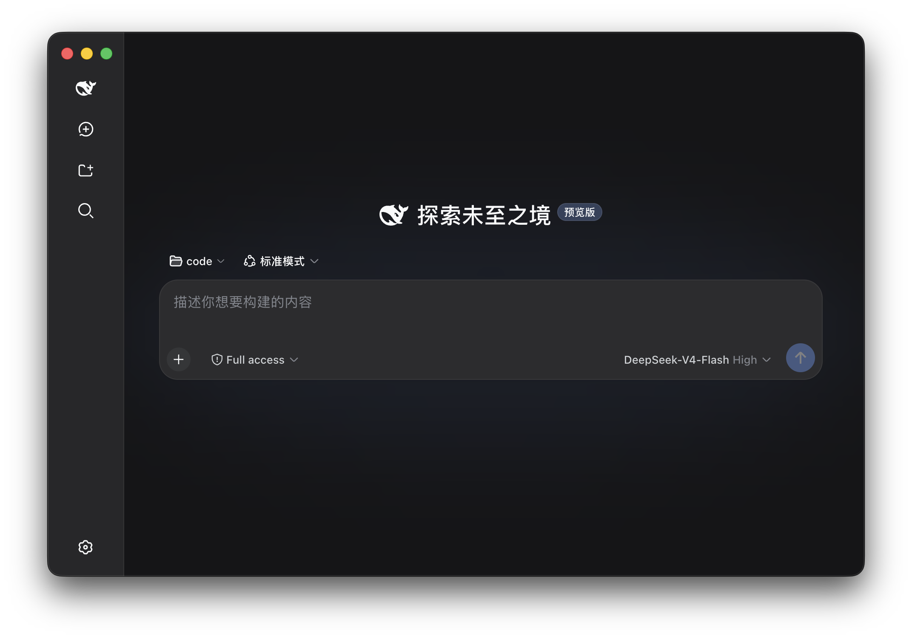
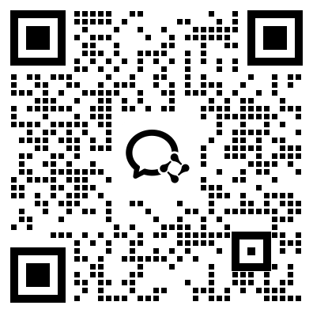

<h1 align="center">DeepSeek Harness <sup>DESKTOP</sup></h1>

<p align="center">
  <a href="https://github.com/anywhere-labs/deepseek-harness-desktop"></a>
  
  <a href="LICENSE"></a>
  <a href="https://discord.gg/TJeGqKRNM"></a>
  
</p>

<p align="center"><sub>中文 · <a href="README.en.md">English</a></sub></p>

<p align="center">
  <strong>基于官方 DeepSeek Harness 打造的 Electron 桌面端</strong><br>
  DeepSeek 官方目前通过命令行启动本地 Web UI。这个项目在官方 DeepSeek Harness 的基础上增加了 Electron 桌面外壳，负责启动和管理本地 Harness 服务，让用户无需配置 Node.js 或执行命令，即可直接使用。
</p>

<a id="run"></a>

<h3 align="center"><a href="https://www.deepseekdesktop.com"><ins>Download Desktop</ins></a></h3>

<p align="center">
  
</p>

## 主要功能

<table>
  <tr>
    <td width="50%" valign="top">
      <h3>Desktop</h3>
      <p>把官方 DeepSeek Harness 的本地 Web UI 带到原生桌面。应用自动启动和管理本地 Harness 服务，集成系统托盘与桌面窗口，无需安装 Node.js 或执行命令。</p>
    </td>
    <td width="50%" valign="top">
      <h3>手机远程控制 </h3>
      <p>通过 iOS 和 Android 远程连接 Desktop，在手机上发起任务、查看 Agent 进度，并在需要时继续跟进。</p>
    </td>
  </tr>
  <tr>
    <td width="50%" valign="top">
      <h3>插件市场 </h3>
      <p>Harness 遵循“一切皆插件”的架构。桌面端插件市场将提供插件的发现、安装、更新和管理，让模型、工具、界面与工作流能力按需组合。</p>
    </td>
    <td width="50%" valign="top">
      <h3>Channels </h3>
      <p>接入微信、飞书、Discord、WhatsApp 等 IM 通道，直接在日常聊天工具中向 Agent 发起任务、接收进度并继续对话。</p>
    </td>
  </tr>
</table>

## 与官方项目的关系

本项目基于 [deepseek-ai/deepseek-harness](https://github.com/deepseek-ai/deepseek-harness) 构建。

DeepSeek Harness 的核心能力、插件系统和 Web UI 来自官方项目。本项目主要负责：

- Electron 桌面封装
- 本地服务生命周期管理
- 桌面窗口和系统托盘集成
- macOS、Windows 安装包构建与发布
- 桌面环境下的界面适配

如果你希望通过命令行运行 Harness，或者参与核心功能开发，请优先查看官方仓库。

<a id="run-from-source"></a>

## 开发

桌面端代码位于：

```text
apps/desktop
```

安装依赖并启动桌面应用：

```sh
pnpm install
pnpm run dev:desktop
```

## 社区交流

可选择常用的平台参与讨论，交流使用问题、插件开发和项目进展。

<table>
  <thead>
    <tr>
      <th align="center">微信群</th>
      <th align="center">QQ群</th>
    </tr>
  </thead>
  <tbody>
    <tr>
      <td align="center"></td>
      <td align="center"></td>
    </tr>
  </tbody>
</table>

Discord：[加入 DeepSeek Harness Desktop 社区](https://discord.gg/TJeGqKRNM)

## License

本项目遵循 [MIT License](LICENSE)。

> 本项目是基于 DeepSeek Harness 构建的社区桌面版本，并非 DeepSeek 官方产品。
